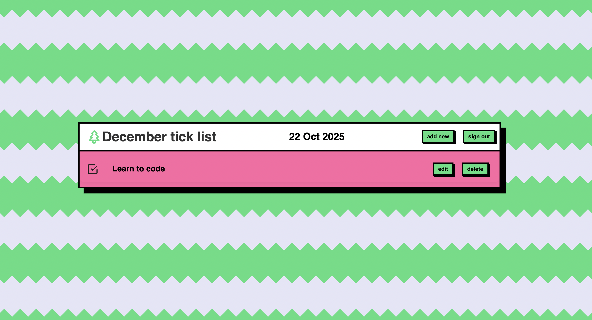
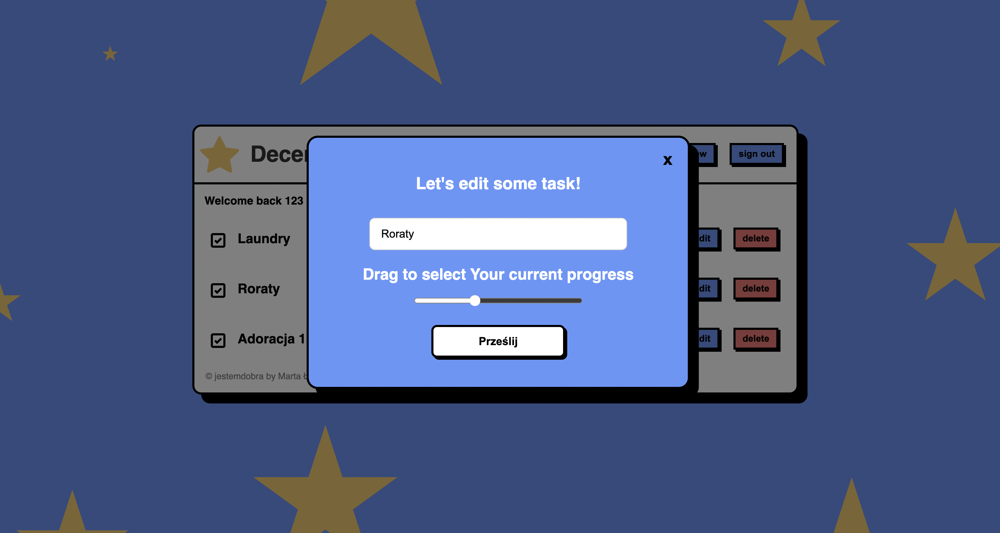
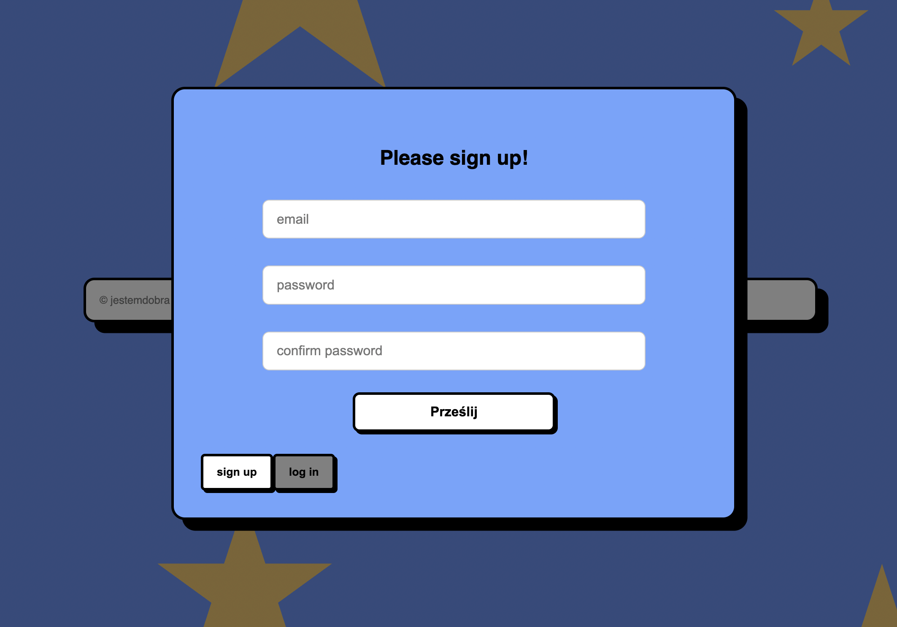
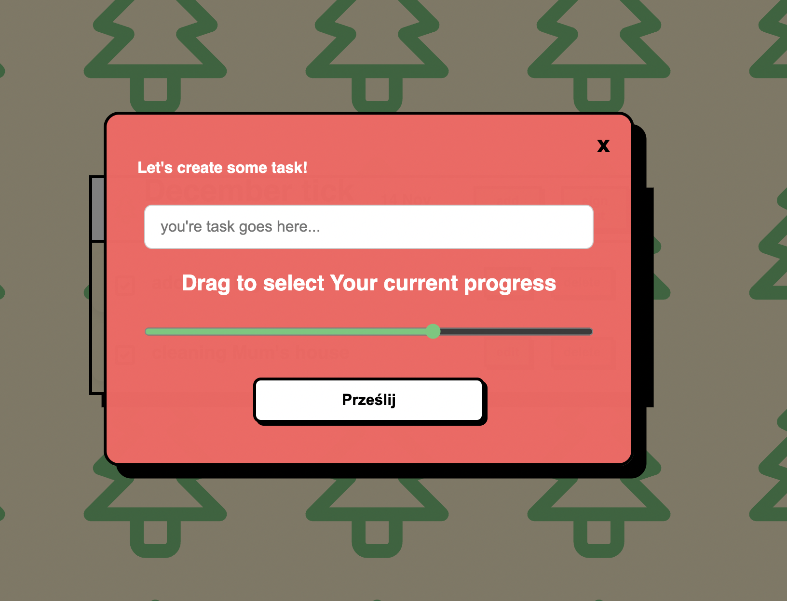

# 🎄 TO-DO List — Full-Stack *Christmas Edition*  

## ✨ About the Project  
I'm excited to present my final project from Ania Kubow’s Full-Stack Developer Course — a complete end-to-end **To-Do application**, built to demonstrate practical, production-ready skills.

The backend is powered by **Node.js** and **Express.js**, handling structured routing, secure authorization, and all database operations. On the frontend, I used **React** to create a polished, responsive interface.

A key element of this project is its connection to a real **PostgreSQL** database, allowing users to seamlessly manage their personal daily tasks. Working with **JWT**, **cookies**, and **password hashing (bcrypt)** gave me a strong foundation in modern authentication.

This project reflects not only my technical abilities, but also my joy in learning, experimenting, and building things that feel fun — hence the Christmas edition 🎄✨  

## ✨ Features  

### 🔐 User Authentication
- Secure sign-up and log-in flow  
- Password hashing with **bcrypt**  
- JWT token-based authentication (1-hour expiry)  
- Cookies used for session handling  

### 📝 Task Management
- Create new tasks  
- Edit existing tasks  
- Delete tasks  
- Tasks automatically sort by date  
- Persistent storage using PostgreSQL  

### 🎨 Frontend UI & UX
- Fully responsive React interface  
- Custom modals for editing tasks  
- SVG icons and themed styling  
- Smooth user experience  

### 🗄️ Backend Logic
- REST API built with Express.js  
- Structured routing  
- SQL queries for all CRUD operations  
- Secure database access layer  

## 🍬 Kinsta Settings  
I also had the opportunity to deploy my app on Kinsta servers.  
Right now it's a bit too expensive for me — but the important thing is:  
**I know exactly how to set it up and deploy it when the time comes!** 🚀

## 🍬 First Look  

Just a simple table with rows and interactive buttons; the date is updated daily.

A pop-up modal for adding or editing a task:

Secure authentication modals with strong password hashing and 1-hour JWT expiry:

## 🍬 Technologies  

- React  
- Node.js  
- Express.js  
- PostgreSQL  
- JWT  
- bcrypt  
- cookies !

## 🍬 Inspiration  
This project was created as part of the amazing *Full Stack Developer Course* by  
**♥ Ania Kubow ♥**.  
I absolutely adore her humor and teaching style — she has a way of making complex coding concepts finally click.  

---
---

This project was bootstrapped with [Create React App](https://github.com/facebook/create-react-app).

## Available Scripts

In the project directory, you can run:

### `npm start`

Runs the app in the development mode.\
Open [http://localhost:3000](http://localhost:3000) to view it in your browser.

The page will reload when you make changes.\
You may also see any lint errors in the console.

### `npm test`

Launches the test runner in the interactive watch mode.\
See the section about [running tests](https://facebook.github.io/create-react-app/docs/running-tests) for more information.

### `npm run build`

Builds the app for production to the `build` folder.\
It correctly bundles React in production mode and optimizes the build for the best performance.

The build is minified and the filenames include the hashes.\
Your app is ready to be deployed!

See the section about [deployment](https://facebook.github.io/create-react-app/docs/deployment) for more information.

### `npm run eject`

**Note: this is a one-way operation. Once you `eject`, you can't go back!**

If you aren't satisfied with the build tool and configuration choices, you can `eject` at any time. This command will remove the single build dependency from your project.

Instead, it will copy all the configuration files and the transitive dependencies (webpack, Babel, ESLint, etc) right into your project so you have full control over them. All of the commands except `eject` will still work, but they will point to the copied scripts so you can tweak them. At this point you're on your own.

You don't have to ever use `eject`. The curated feature set is suitable for small and middle deployments, and you shouldn't feel obligated to use this feature. However we understand that this tool wouldn't be useful if you couldn't customize it when you are ready for it.

## Learn More

You can learn more in the [Create React App documentation](https://facebook.github.io/create-react-app/docs/getting-started).

To learn React, check out the [React documentation](https://reactjs.org/).

### Code Splitting

This section has moved here: [https://facebook.github.io/create-react-app/docs/code-splitting](https://facebook.github.io/create-react-app/docs/code-splitting)

### Analyzing the Bundle Size

This section has moved here: [https://facebook.github.io/create-react-app/docs/analyzing-the-bundle-size](https://facebook.github.io/create-react-app/docs/analyzing-the-bundle-size)

### Making a Progressive Web App

This section has moved here: [https://facebook.github.io/create-react-app/docs/making-a-progressive-web-app](https://facebook.github.io/create-react-app/docs/making-a-progressive-web-app)

### Advanced Configuration

This section has moved here: [https://facebook.github.io/create-react-app/docs/advanced-configuration](https://facebook.github.io/create-react-app/docs/advanced-configuration)

### Deployment

This section has moved here: [https://facebook.github.io/create-react-app/docs/deployment](https://facebook.github.io/create-react-app/docs/deployment)

### `npm run build` fails to minify

This section has moved here: [https://facebook.github.io/create-react-app/docs/troubleshooting#npm-run-build-fails-to-minify](https://facebook.github.io/create-react-app/docs/troubleshooting#npm-run-build-fails-to-minify)
